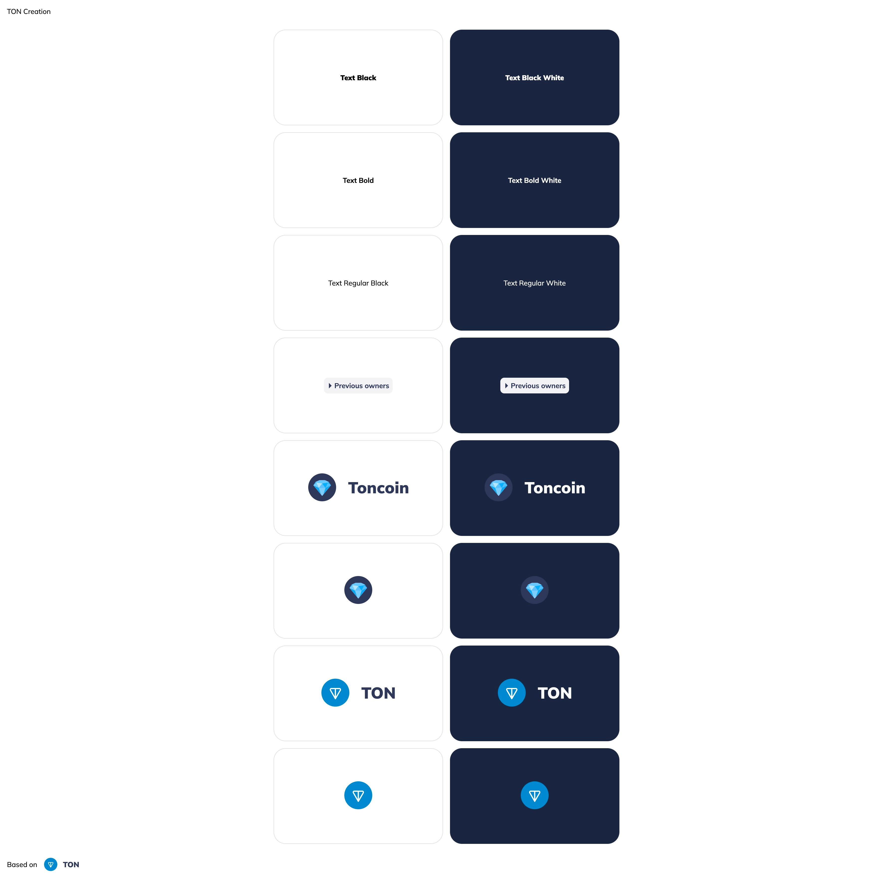

# TON Design System Vite Vanilla TS

## Available languages

[](https://github.com/designervoid/ton-design-system-vite-vanilla-ts/blob/master/README.md)

[](https://github.com/designervoid/ton-design-system-vite-vanilla-ts/blob/master/README.ru.md)

## Overview

This repo shows how to build components with [TON Design System](https://github.com/designervoid/ton-design-system)

## Quick start

`Github` rejecting downloads packages without token, so you need set environment variable `GITHUB_TOKEN` (1), you should create `.npmrc` (2), download packages (3), run `dev` server (4).

### Development environment

```zsh
export GITHUB_TOKEN=your_token # 1

cp .npmrc.example .npmrc # 2

npm install # 3

npm run dev # 4
```

### Production environment

```zsh
npm run preview -- --host
```

## Result of quick start



## License

MIT
