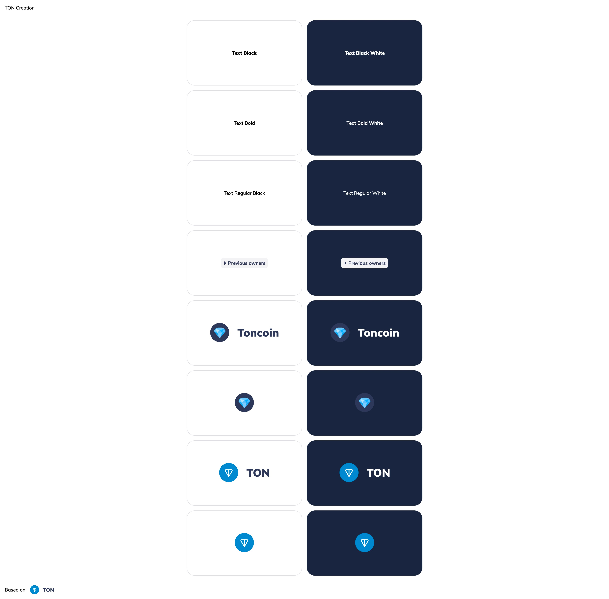

# TON Design System Vite Vanilla TS

## Доступные языки

[](https://github.com/designervoid/ton-design-system-vite-vanilla-ts/blob/master/README.md)

[](https://github.com/designervoid/ton-design-system-vite-vanilla-ts/blob/master/README.ru.md)

## Описание

`Github` не дает загружать публичные пакеты без токена, поэтому требуется задать переменную `GITHUB_TOKEN`(1), создать файл `.npmrc` (2), установить пакеты (3), запустить `dev` сервер (4).

### Дев окружение

```zsh
export GITHUB_TOKEN=your_token # 1

cp .npmrc.example .npmrc # 2

npm install # 3

npm run dev # 4
```

### Продакшн окружение

```zsh
npm run preview -- --host
```

## Результат быстрого запуска



## Лицензия

MIT
